#  GitHub Followers is an iOS app designed to help users explore and interact with GitHub developers. 

# Description: 
### With GitHub Followers, you can:
- Search for GitHub users by their username.
- View detailed profiles of GitHub users, including their bio, repositories, followers, and following.
- Add your favorite GitHub users to a favorites list for easy access.
- Seamlessly navigate to a user's GitHub profile directly from the app.

#### Whether you're interested in discovering new developers or keeping track of your favorites, GitHub Followers simplifies the process, making it easier than ever to connect with the GitHub community.

## Getting Started

### Prerequisites
Before you begin, ensure you have met the following requirements:
- Xcode installed on your machine

### Installation
1. Clone the repository to your local machine using the following command:
git clone https://github.com/turgunbaevaa/GHFollowers

2. Navigate to the project directory:
cd GHFollowers

### Running the App
1. Open the project in Xcode by double-clicking the `.xcworkspace` file.
2. Build and run the project using the play button in Xcode.

## Usage

### Searching for Developers
1. Open the app and navigate to the search tab.
2. Enter the username of the developer you want to search for(For test you can use SAllen0400, dyang and etc.).
3. Tap the "Get Followers" button to view the search results.

### Viewing Developer Profiles
1. After performing a search, tap on the developer's name to view their profile.
2. You'll open developer's info page where you can find:
    - Name, location, bio
    - GitHub profile link (tap to the "Github Profile" button)
    - And you can check followers of the developer and add developer to the favorites list (tap to "+" button)

### Browsing Favorites
1. Navigate to the favorites tab to view your list of favorite developers.
2. Tap on a developer to view their profile and repositories.
3. To remove a developer from the favorites list, you can swipe their item to the left and tap the delete button.

## Structure
- "Utilities": 
    - Constants: Contains files with constant values used throughout the application.
    - Error Messages: Contains files with error messages.
    - UIHelper: Contains files with utility functions for UI layout, such as creating a three-column flow layout.
- "Managers":
    - NetworkManager: Contains functions for retrieving user information, downloading images, and fetching followers from external API.
    - PersistenceManager: It provides methods for adding or removing followers, retrieving favorites, and saving changes to UserDefaults.
- "Model": Models for retrieving follower(on search screen) and user(on user info screen).
- "Extensions": Collection of extensions for simplified and optimized code.
- "Custom Views": Repository for reusable custom UI components, including buttons, text fields, cells, and view controllers (excluding main ones), and etc. to facilitate code reusability.
- "Screens": Contains main view controllers for key app features, including SearchVC, FavoritesListVC, FollowerListVC, and UserInfoVC.
- "Support": Contains App/SceneDelegates, Assets and Launch Screen.

## Dependencies:
[SnapKit GitHub Repository](https://github.com/SnapKit/SnapKit)

## API
[REST API endpoints for followers](https://docs.github.com/en/rest/users/followers?apiVersion=2022-11-28)

## Demo Images

Main Screen

### Main Search Screen:

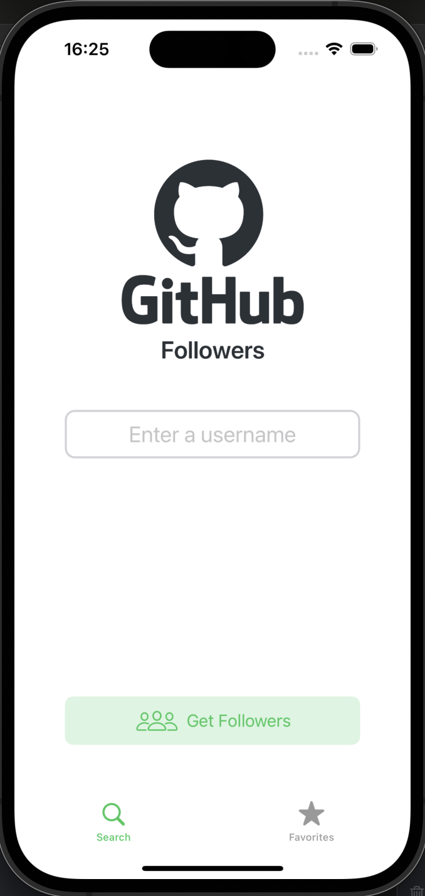

### Search with username:

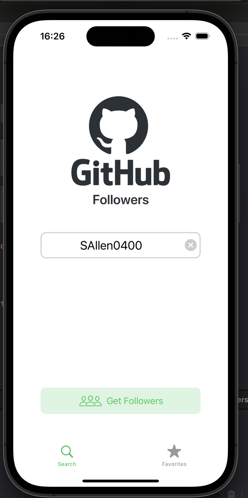

### Search with empty username:

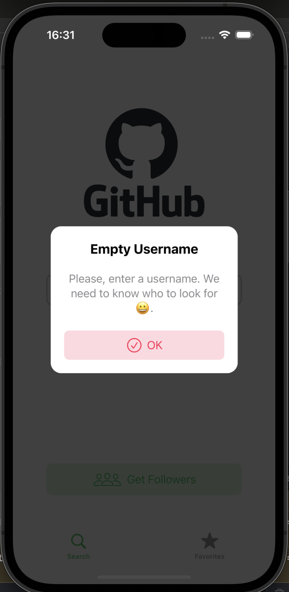

### Search with undefined username:

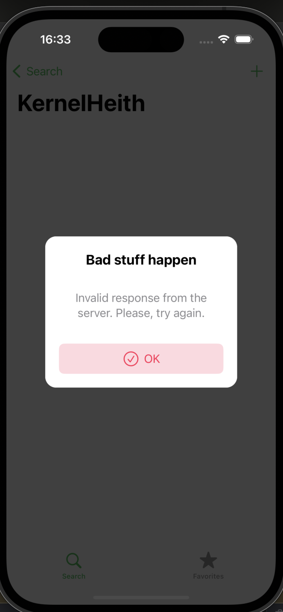

### Loading Followers List:

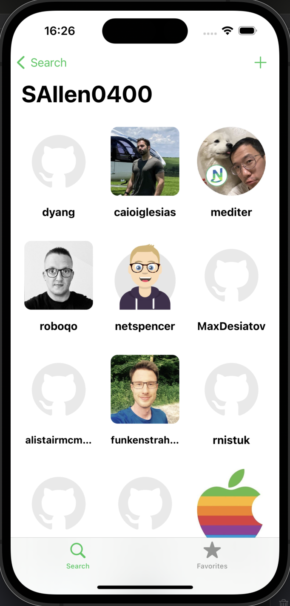

### Loaded Followers List:

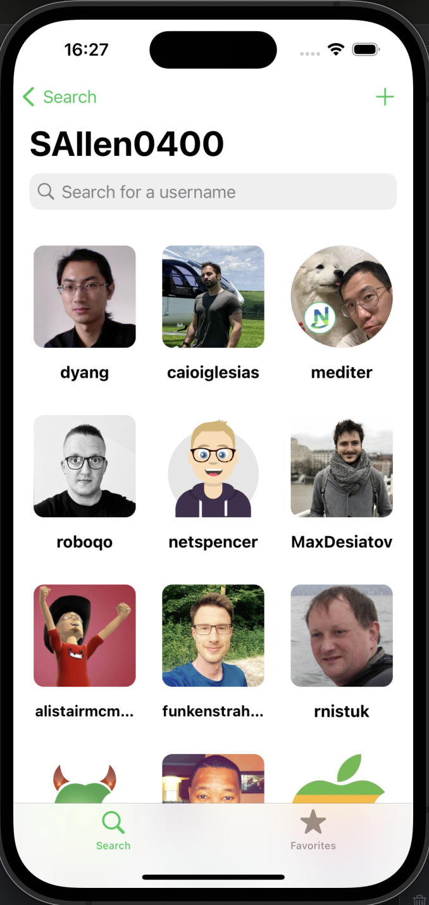

### Developer's bio:

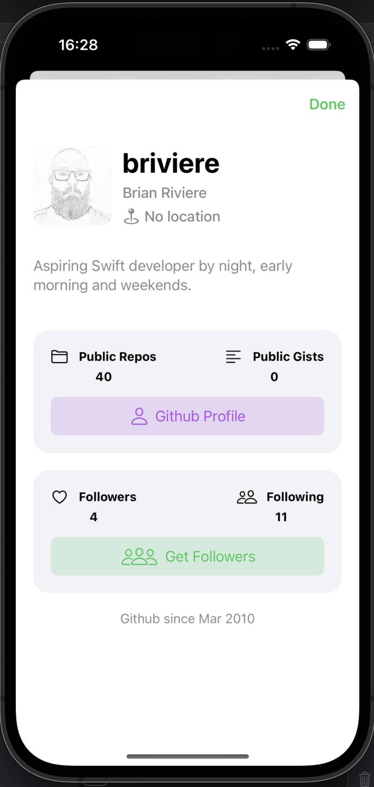

### Developer's github profile:

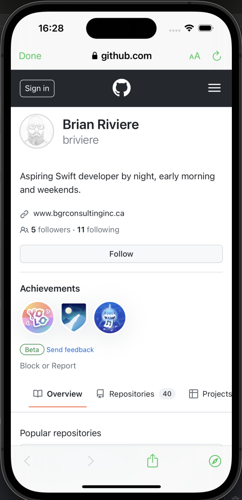

### Developer's follower's list:

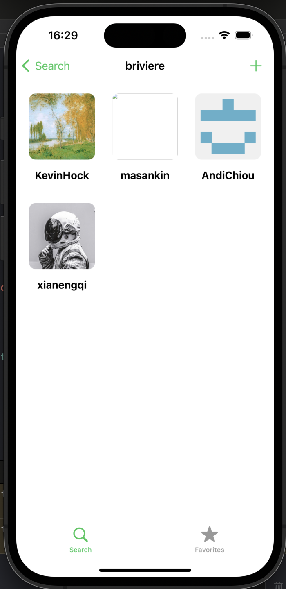

### Add developer to favorite list:

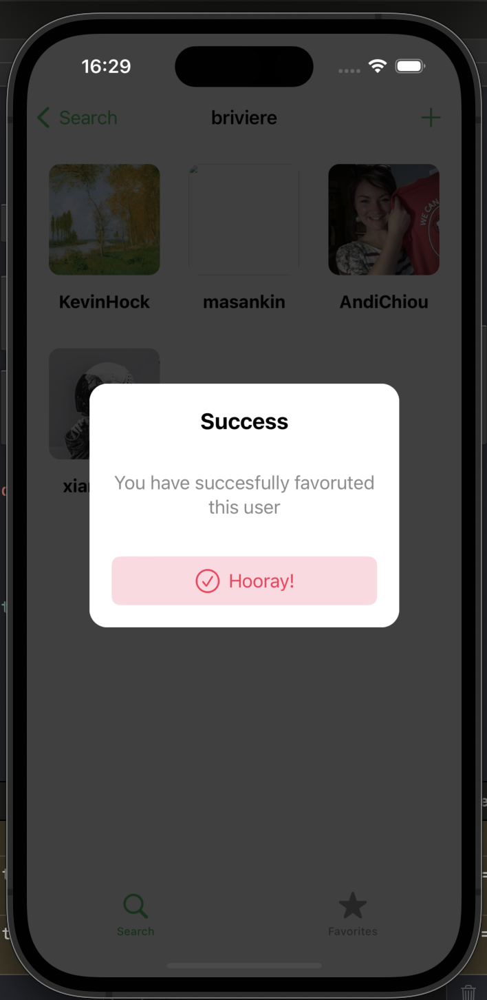

### Favorite list:

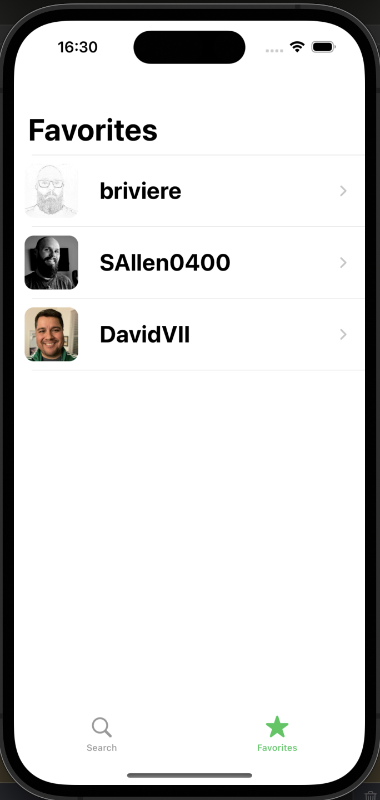

### Delete from favorite list:

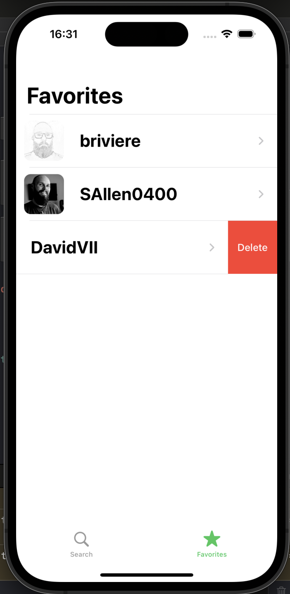

### Empty favorite list:

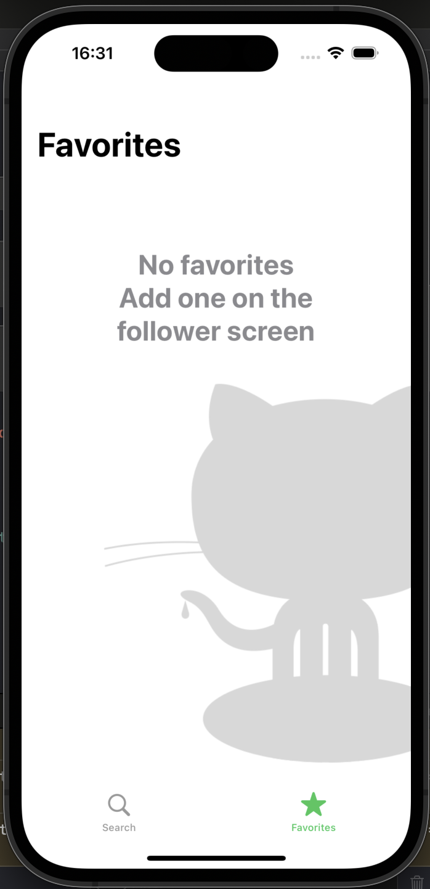

### Developer with no followers:

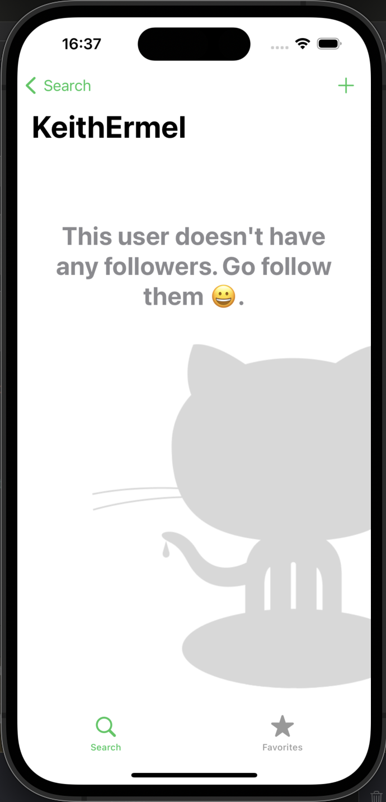

